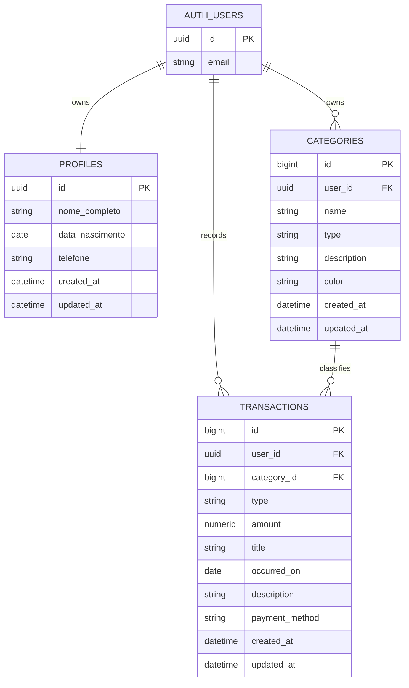

# Esquema de banco de dados

Este documento descreve o modelo de dados do SpendSmart com Supabase Auth e Supabase PostgreSQL.
As migrations correspondentes estao em `supabase/migrations/`:

| Migration | O que faz |
| --- | --- |
| `001_create_financial_schema.js` | Cria as tres tabelas de dominio, constraints, indices, chaves estrangeiras para `auth.users` e as politicas RLS |
| `1790304277043_add-rbac-permissions.js` | Concede `GRANT` a `service_role` e `authenticated` sobre as tabelas e sequencias |

> A segunda migration so tem efeito no Supabase: como `auth.users` nao existe no PostgreSQL
> local, todo o seu corpo fica dentro de um `IF` que nao e satisfeito. Ver §7.

## Schemas do Supabase

O PostgreSQL organiza objetos em schemas. Neste projeto, os dois schemas relevantes sao:

### `auth`

O schema `auth` e gerenciado pelo Supabase Auth. A tabela `auth.users` representa as contas autenticadas.

Informacoes conceituais disponiveis:

| Campo | Funcao |
| --- | --- |
| `id` | UUID unico da conta e identidade usada nas politicas RLS |
| `email` | Email da conta, gerenciado pelo Auth |
| credenciais | Gerenciadas e protegidas pelo Supabase Auth |
| sessao | Tokens e estado de autenticacao gerenciados pelo Auth |

A aplicacao nao deve criar `auth.users`, armazenar uma senha paralela ou depender da estrutura interna completa dessa tabela. O contrato usado pela aplicacao e o `id` autenticado e, quando necessario, o email fornecido pelo Auth.

### `public`

O schema `public` contem as tabelas de dominio da aplicacao:

```text
public.profiles
public.categories
public.transactions
```

O schema nao e uma tabela. Ele funciona como um namespace que organiza as tabelas.

## Modelo de identidade

O mesmo UUID identifica a conta autenticada e os registros pertencentes a ela:

```text
auth.users.id = profiles.id
auth.users.id = categories.user_id
auth.users.id = transactions.user_id
```

O frontend nunca escolhe nem incrementa `user_id`. O usuario e identificado pela sessao do Supabase Auth, e as politicas RLS comparam essa identidade com cada registro.

> Essas igualdades so se sustentam no Supabase. No PostgreSQL local nao existe `auth.users`, e
> portanto nao existem nem a FK que liga as tabelas a ele nem o RLS. Ver §7.

## Tabelas publicas

### `public.profiles`

Perfil complementar da conta autenticada. Nao armazena senha.

| Coluna | Tipo | Regra |
| --- | --- | --- |
| `id` | `uuid` | PK; FK para `auth.users.id`, criada apenas no Supabase (ver §7) |
| `nome_completo` | `text` | Obrigatorio |
| `data_nascimento` | `date` | Opcional |
| `telefone` | `text` | Opcional |
| `created_at` | `timestamptz` | Default `now()` |
| `updated_at` | `timestamptz` | Default `now()` |

O `profiles.id` recebe o UUID criado pelo Supabase Auth. Ele nao possui UUID aleatorio automatico.

> `profiles` e a unica tabela com colunas de dominio em portugues. `categories` e `transactions`
> usam ingles. A padronizacao proposta esta em
> [Migrações Futuras](future-migrations.md#proposta-1--padronizar-profiles-para-ingles).

### `public.categories`

Categorias usadas para classificar transacoes.

| Coluna | Tipo | Regra |
| --- | --- | --- |
| `id` | `bigint` | PK gerada pelo banco |
| `user_id` | `uuid` | FK para `auth.users.id`, obrigatorio |
| `name` | `text` | Obrigatorio |
| `type` | `text` | `income` ou `expense` |
| `description` | `text` | Opcional |
| `color` | `text` | Cor hexadecimal, default `#FFFFFF` |
| `created_at` | `timestamptz` | Default `now()` |
| `updated_at` | `timestamptz` | Default `now()` |

Regras:

```sql
check (type in ('income', 'expense'))
unique (user_id, name, type)
```

### `public.transactions`

Um lancamento financeiro. A coluna `type` diferencia entrada e saida:

- `income`: dinheiro recebido pelo usuario;
- `expense`: dinheiro pago pelo usuario.

| Coluna | Tipo | Regra |
| --- | --- | --- |
| `id` | `bigint` | PK gerada pelo banco |
| `user_id` | `uuid` | FK para `auth.users.id`, obrigatorio |
| `category_id` | `bigint` | FK para `categories.id`, obrigatorio |
| `type` | `text` | `income` ou `expense` |
| `amount` | `numeric(12,2)` | Maior que zero |
| `title` | `text` | Nome ou fonte do lancamento |
| `occurred_on` | `date` | Data do lancamento |
| `description` | `text` | Opcional |
| `payment_method` | `text` | Opcional |
| `created_at` | `timestamptz` | Default `now()` |
| `updated_at` | `timestamptz` | Default `now()` |

Regras:

```sql
check (type in ('income', 'expense'))
check (amount > 0)
```

A aplicacao deve garantir que `transactions.type` seja igual ao tipo da categoria escolhida.

## Diagrama entidade-relacionamento



## Relacionamentos e exclusao

- Uma conta autenticada possui um perfil.
- Uma conta pode possuir varias categorias.
- Uma conta pode possuir varias transacoes.
- Uma categoria pode classificar varias transacoes.
- A exclusao da conta usa `on delete cascade` para seus dados privados (Supabase).
- A exclusao de uma categoria em uso usa `on delete restrict`; transacoes nao sao apagadas silenciosamente.
- A aplicacao deve validar que categoria e transacao pertencem ao mesmo usuario e possuem o mesmo tipo.

## Esquema Relacional (3FN)

```text
users(id, email)
profiles(id*, nome_completo, data_nascimento, telefone, created_at, updated_at)
  Nota: o id e PK e FK ao mesmo tempo, garantindo a relacao 1:1 com users.
categories(id, user_id*, name, type, description, color, created_at, updated_at)
  user_id referencia users(id)
transactions(id, user_id*, category_id*, type, amount, title, occurred_on, description, payment_method, created_at, updated_at)
  user_id referencia users(id)
  category_id referencia categories(id)
```

`users` corresponde a `auth.users`, gerenciada pelo Supabase. As tres tabelas estao em 3FN: nao ha
dependencia transitiva entre colunas nao-chave, e todo atributo nao-chave depende da chave
inteira da sua tabela.

## Indices


Indices aceleram consultas frequentes sem alterar os dados. A migration cria:

```sql
create index categories_user_id_idx on public.categories (user_id);
create index transactions_user_date_idx on public.transactions (user_id, occurred_on);
create index transactions_user_type_idx on public.transactions (user_id, type);
create index transactions_category_idx on public.transactions (category_id);
```

## Row Level Security

RLS significa Row Level Security. Com RLS, o banco aplica regras por linha e impede que um usuario leia ou altere registros de outro usuario.

Politicas criadas em `001_create_financial_schema.js:118-120`:

```sql
profiles:     USING      (id = auth.uid()) WITH CHECK (id = auth.uid())
categories:   USING      (user_id = auth.uid()) WITH CHECK (user_id = auth.uid())
transactions: USING      (user_id = auth.uid()) WITH CHECK (user_id = auth.uid())
```

As tres sao `FOR ALL`. O `USING` filtra a leitura e o `WITH CHECK` valida a escrita, entao um
`UPDATE` nao consegue mover um registro para fora do proprio `user_id`.

As politicas usam a identidade da sessao do Supabase Auth. Elas nao confiam em um `user_id` enviado pelo frontend.

O RLS e a ultima barreira, nao a unica. Os services filtram por `user_id` explicitamente em toda
leitura e escrita, conforme `services/categoryService.js:31,41` e
`services/transactionService.js:33,46`.

## Limites conhecidos

Registrados aqui para que ninguem os descubra em producao.

| Limite | Consequencia |
| --- | --- |
| O RLS so e criado se `auth.users` existir | No PostgreSQL local **nunca** e aplicado. Um banco local tem zero isolamento entre usuarios. |
| O isolamento entre dois usuarios nunca foi exercitado | Os casos IT-01 e IT-02 do [plano de testes](test-plan.md#22-testes-de-integracao) ainda nao rodaram. |
| `transactions.type` nao e validado contra `categories.type` | Um lancamento pode apontar para categoria de tipo oposto e corromper o dashboard. |
| `updated_at` nao tem trigger | A coluna registra apenas o instante da insercao, nunca a ultima alteracao. |
| `profiles` usa portugues; as outras duas, ingles | Inconsistencia de nomenclatura. Issue [#8](https://github.com/MViniciusCoffe/SpendSmart/issues/8). |

As tres primeiras pendencias tem script pronto em [Future Migrations](future-migrations.md).

## Ambiente local e Supabase

O PostgreSQL local valida tabelas, constraints, indices e migrations. O Supabase adiciona `auth.users`, `auth.uid()`, RLS e os `GRANT` de `service_role` e `authenticated`. Por isso, as duas migrations verificam se `auth.users` existe antes de criar essas referencias, usando o guard `IF to_regclass('auth.users') IS NOT NULL` (`001_create_financial_schema.js:101`, `1790304277043_add-rbac-permissions.js:7`).

O efeito colateral do guard e que **o banco local nao tem RLS nem FK para `auth.users`**. Isso e
aceito como consequencia de rodar a mesma migration em dois motores, e esta registrado na issue
[#20](https://github.com/MViniciusCoffe/SpendSmart/issues/20). O isolamento entre dois usuarios
precisa ser validado em um projeto Supabase antes da entrega.
