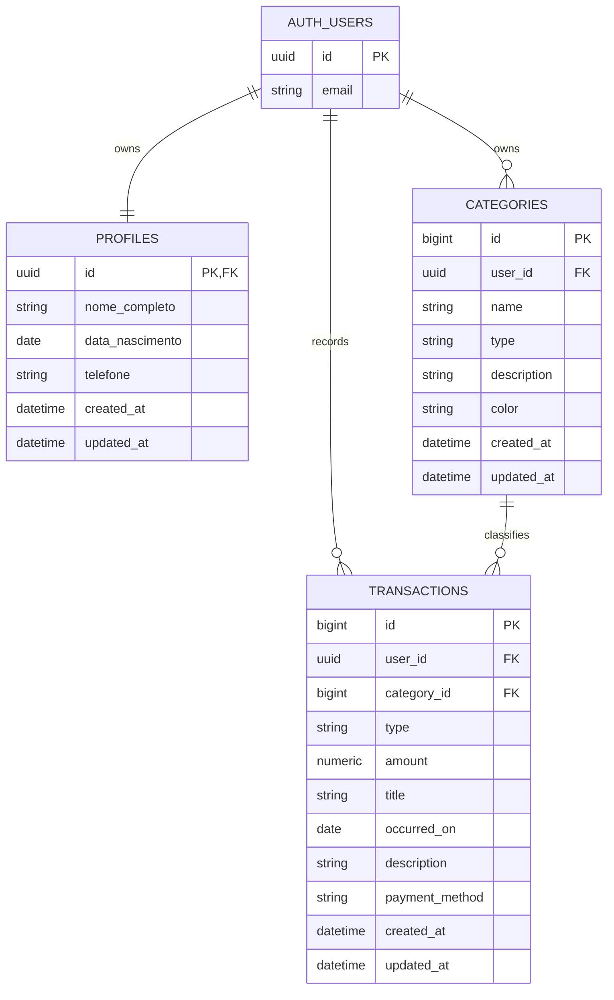

# Esquema de banco de dados

Este documento descreve o modelo de dados planejado para o SpendSmart com Supabase Auth e Supabase PostgreSQL. A migration correspondente esta em `supabase/migrations/001_create_financial_schema.js`.

## Schemas do Supabase

O PostgreSQL organiza objetos em schemas. Neste projeto, os dois schemas relevantes sao:

### `auth`

O schema `auth` e gerenciado pelo Supabase Auth. A tabela `auth.users` representa as contas autenticadas.

Informacoes conceituais disponiveis:

| Campo | Funcao |
| --- | --- |
| `id` | UUID unico da conta e identidade usada nas politicas RLS |
| `email` | Email da conta, gerenciado pelo Auth |
| credenciais | Gerenciadas e protegidas pelo Supabase Auth |
| sessao | Tokens e estado de autenticacao gerenciados pelo Auth |

A aplicacao nao deve criar `auth.users`, armazenar uma senha paralela ou depender da estrutura interna completa dessa tabela. O contrato usado pela aplicacao e o `id` autenticado e, quando necessario, o email fornecido pelo Auth.

### `public`

O schema `public` contem as tabelas de dominio da aplicacao:

```text
public.profiles
public.categories
public.transactions
```

O schema nao e uma tabela. Ele funciona como um namespace que organiza as tabelas.

## Modelo de identidade

O mesmo UUID identifica a conta autenticada e os registros pertencentes a ela:

```text
auth.users.id = profiles.id
auth.users.id = categories.user_id
auth.users.id = transactions.user_id
```

O frontend nunca escolhe nem incrementa `user_id`. O usuario e identificado pela sessao do Supabase Auth, e as politicas RLS comparam essa identidade com cada registro.

## Tabelas publicas

### `public.profiles`

Perfil complementar da conta autenticada. Nao armazena senha.

| Coluna | Tipo | Regra |
| --- | --- | --- |
| `id` | `uuid` | PK e FK para `auth.users.id` |
| `nome_completo` | `text` | Obrigatorio |
| `data_nascimento` | `date` | Opcional |
| `telefone` | `text` | Opcional |
| `created_at` | `timestamptz` | Default `now()` |
| `updated_at` | `timestamptz` | Default `now()` |

O `profiles.id` recebe o UUID criado pelo Supabase Auth. Ele nao possui UUID aleatorio automatico.

### `public.categories`

Categorias usadas para classificar transacoes.

| Coluna | Tipo | Regra |
| --- | --- | --- |
| `id` | `bigint` | PK gerada pelo banco |
| `user_id` | `uuid` | FK para `auth.users.id`, obrigatorio |
| `name` | `text` | Obrigatorio |
| `type` | `text` | `income` ou `expense` |
| `description` | `text` | Opcional |
| `color` | `text` | Cor hexadecimal, default `#FFFFFF` |
| `created_at` | `timestamptz` | Default `now()` |
| `updated_at` | `timestamptz` | Default `now()` |

Regras:

```sql
check (type in ('income', 'expense'))
unique (user_id, name, type)
```

### `public.transactions`

Um lancamento financeiro. A coluna `type` diferencia entrada e saida:

- `income`: dinheiro recebido pelo usuario;
- `expense`: dinheiro pago pelo usuario.

| Coluna | Tipo | Regra |
| --- | --- | --- |
| `id` | `bigint` | PK gerada pelo banco |
| `user_id` | `uuid` | FK para `auth.users.id`, obrigatorio |
| `category_id` | `bigint` | FK para `categories.id`, obrigatorio |
| `type` | `text` | `income` ou `expense` |
| `amount` | `numeric(12,2)` | Maior que zero |
| `title` | `text` | Nome ou fonte do lancamento |
| `occurred_on` | `date` | Data do lancamento |
| `description` | `text` | Opcional |
| `payment_method` | `text` | Opcional |
| `created_at` | `timestamptz` | Default `now()` |
| `updated_at` | `timestamptz` | Default `now()` |

Regras:

```sql
check (type in ('income', 'expense'))
check (amount > 0)
```

A aplicacao deve garantir que `transactions.type` seja igual ao tipo da categoria escolhida.

## Diagrama entidade-relacionamento



## Relacionamentos e exclusao

- Uma conta autenticada possui um perfil.
- Uma conta pode possuir varias categorias.
- Uma conta pode possuir varias transacoes.
- Uma categoria pode classificar varias transacoes.
- A exclusao da conta usa `on delete cascade` para seus dados privados.
- A exclusao de uma categoria em uso usa `on delete restrict`; transacoes nao sao apagadas silenciosamente.
- A aplicacao deve validar que categoria e transacao pertencem ao mesmo usuario e possuem o mesmo tipo.

## Indices

Indices aceleram consultas frequentes sem alterar os dados. A migration cria:

```sql
create index categories_user_id_idx on public.categories (user_id);
create index transactions_user_date_idx on public.transactions (user_id, occurred_on);
create index transactions_user_type_idx on public.transactions (user_id, type);
create index transactions_category_idx on public.transactions (category_id);
```

## Row Level Security

RLS significa Row Level Security. Com RLS, o banco aplica regras por linha e impede que um usuario leia ou altere registros de outro usuario.

Politicas conceituais:

```sql
profiles: id = auth.uid()
categories: user_id = auth.uid()
transactions: user_id = auth.uid()
```

As politicas usam a identidade da sessao do Supabase Auth. Elas nao confiam em um `user_id` enviado pelo frontend.

## Ambiente local e Supabase

O PostgreSQL local valida tabelas, constraints, indices e migrations. O Supabase adiciona `auth.users`, `auth.uid()` e RLS. Por isso, a migration verifica se `auth.users` existe antes de criar as referencias e politicas especificas do Supabase.

O isolamento entre dois usuarios ainda precisa ser validado em um projeto Supabase antes da entrega de producao.
