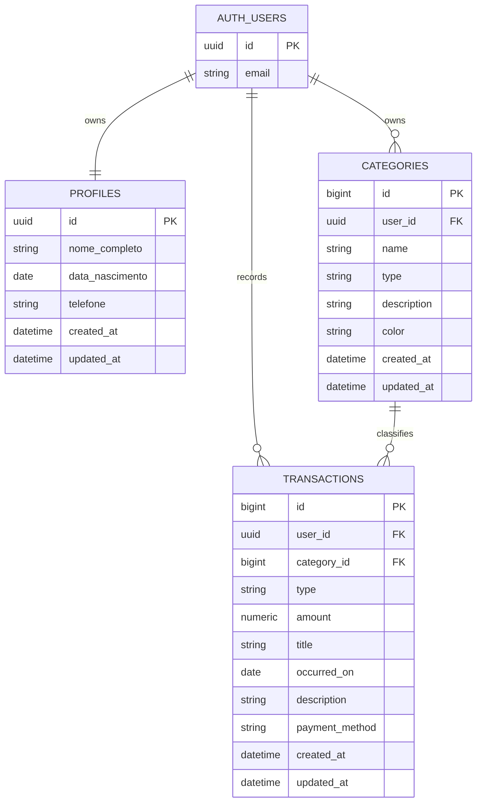

# Esquema de banco de dados

Este documento descreve o modelo de dados do SpendSmart com Supabase Auth e Supabase PostgreSQL.
As migrações correspondentes estão em `supabase/migrations/`:

| Migration                               | O que faz                                                                                                                       |
| :-------------------------------------- | :------------------------------------------------------------------------------------------------------------------------------ |
| `001_create_financial_schema.js`        | Cria as três tabelas de domínio, restrições (_constraints_), índices, chaves estrangeiras para `auth.users` e as políticas RLS. |
| `1790304277043_add-rbac-permissions.js` | Concede `GRANT` a `service_role` e `authenticated` sobre as tabelas e sequências.                                               |

> A segunda migração só tem efeito no Supabase: como `auth.users` não existe no PostgreSQL
> local, todo o seu corpo fica dentro de um `IF` que não é satisfeito. Ver §7.

## Esquemas do Supabase

O PostgreSQL organiza objetos em esquemas (_schemas_). Neste projeto, os dois esquemas relevantes são:

### `auth`

O esquema `auth` é gerenciado pelo Supabase Auth. A tabela `auth.users` representa as contas autenticadas.

Informações conceituais disponíveis:

| Campo       | Função                                                    |
| :---------- | :-------------------------------------------------------- |
| `id`        | UUID único da conta e identidade usada nas políticas RLS. |
| `email`     | E-mail da conta, gerenciado pelo Auth.                    |
| credenciais | Gerenciadas e protegidas pelo Supabase Auth.              |
| sessão      | Tokens e estado de autenticação gerenciados pelo Auth.    |

A aplicação não deve criar `auth.users`, armazenar uma senha paralela ou depender da estrutura interna completa dessa tabela. O contrato usado pela aplicação é o `id` autenticado e, quando necessário, o e-mail fornecido pelo Auth.

### `public`

O esquema `public` contém as tabelas de domínio da aplicação:

```text
public.profiles
public.categories
public.transactions
```

O esquema não é uma tabela. Ele funciona como um namespace que organiza as tabelas.

## Modelo de identidade

O mesmo UUID identifica a conta autenticada e os registros pertencentes a ela:

```text
auth.users.id = profiles.id
auth.users.id = categories.user_id
auth.users.id = transactions.user_id
```

O _frontend_ nunca escolhe nem incrementa `user_id`. O usuário é identificado pela sessão do Supabase Auth, e as políticas RLS comparam essa identidade com cada registro.

> Essas igualdades só se sustentam no Supabase. No PostgreSQL local não existe `auth.users`, e
> portanto não existem nem a FK que liga as tabelas a ele, nem o RLS. Ver §7.

## Tabelas públicas

### `public.profiles`

Perfil complementar da conta autenticada. Não armazena senha.

| Coluna            | Tipo          | Regra                                                            |
| :---------------- | :------------ | :--------------------------------------------------------------- |
| `id`              | `uuid`        | PK; FK para `auth.users.id`, criada apenas no Supabase (ver §7). |
| `nome_completo`   | `text`        | Obrigatório.                                                     |
| `data_nascimento` | `date`        | Opcional.                                                        |
| `telefone`        | `text`        | Opcional.                                                        |
| `created_at`      | `timestamptz` | Padrão `now()`.                                                  |
| `updated_at`      | `timestamptz` | Padrão `now()`.                                                  |

O `profiles.id` recebe o UUID criado pelo Supabase Auth. Ele não possui UUID aleatório automático.

> `profiles` é a única tabela com colunas de domínio em português. `categories` e `transactions`
> usam inglês. A padronização proposta está em
> [Migrações Futuras](future-migrations.md#proposta-1--padronizar-profiles-para-inglês).

### `public.categories`

Categorias usadas para classificar transações.

| Coluna        | Tipo          | Regra                                 |
| :------------ | :------------ | :------------------------------------ |
| `id`          | `bigint`      | PK gerada pelo banco.                 |
| `user_id`     | `uuid`        | FK para `auth.users.id`, obrigatório. |
| `name`        | `text`        | Obrigatório.                          |
| `type`        | `text`        | `income` ou `expense`.                |
| `description` | `text`        | Opcional.                             |
| `color`       | `text`        | Cor hexadecimal, padrão `#FFFFFF`.    |
| `created_at`  | `timestamptz` | Padrão `now()`.                       |
| `updated_at`  | `timestamptz` | Padrão `now()`.                       |

Regras:

```sql
check (type in ('income', 'expense'))
unique (user_id, name, type)
```

### `public.transactions`

Um lançamento financeiro. A coluna `type` diferencia entrada e saída:

- `income`: dinheiro recebido pelo usuário;
- `expense`: dinheiro pago pelo usuário.

| Coluna           | Tipo            | Regra                                 |
| :--------------- | :-------------- | :------------------------------------ |
| `id`             | `bigint`        | PK gerada pelo banco.                 |
| `user_id`        | `uuid`          | FK para `auth.users.id`, obrigatório. |
| `category_id`    | `bigint`        | FK para `categories.id`, obrigatório. |
| `type`           | `text`          | `income` ou `expense`.                |
| `amount`         | `numeric(12,2)` | Maior que zero.                       |
| `title`          | `text`          | Nome ou fonte do lançamento.          |
| `occurred_on`    | `date`          | Data do lançamento.                   |
| `description`    | `text`          | Opcional.                             |
| `payment_method` | `text`          | Opcional.                             |
| `created_at`     | `timestamptz`   | Padrão `now()`.                       |
| `updated_at`     | `timestamptz`   | Padrão `now()`.                       |

Regras:

```sql
check (type in ('income', 'expense'))
check (amount > 0)
```

A aplicação deve garantir que `transactions.type` seja igual ao tipo da categoria escolhida.

## Diagrama entidade-relacionamento


```mermaid
erDiagram
  AUTH_USERS {
    uuid id PK
    string email
  }

  PROFILES {
    uuid id PK
    string nome_completo
    date data_nascimento
    string telefone
    datetime created_at
    datetime updated_at
  }

  CATEGORIES {
    bigint id PK
    uuid user_id FK
    string name
    string type
    string description
    string color
    datetime created_at
    datetime updated_at
  }

  TRANSACTIONS {
    bigint id PK
    uuid user_id FK
    bigint category_id FK
    string type
    numeric amount
    string title
    date occurred_on
    string description
    string payment_method
    datetime created_at
    datetime updated_at
  }

  AUTH_USERS ||--|| PROFILES : owns
  AUTH_USERS ||--o{ CATEGORIES : owns
  AUTH_USERS ||--o{ TRANSACTIONS : records
  CATEGORIES ||--o{ TRANSACTIONS : classifies
```

## Relacionamentos e exclusão

- Uma conta autenticada possui um perfil.
- Uma conta pode possuir várias categorias.
- Uma conta pode possuir várias transações.
- Uma categoria pode classificar várias transações.
- A exclusão da conta usa `on delete cascade` para seus dados privados (Supabase).
- A exclusão de uma categoria em uso usa `on delete restrict`; transações não são apagadas silenciosamente.
- A aplicação deve validar que categoria e transação pertencem ao mesmo usuário e possuem o mesmo tipo.

## Esquema Relacional (3FN)

```text
users(id, email)
profiles(id*, nome_completo, data_nascimento, telefone, created_at, updated_at)
  Nota: o id é PK e FK ao mesmo tempo, garantindo a relação 1:1 com users.
categories(id, user_id*, name, type, description, color, created_at, updated_at)
  user_id referencia users(id)
transactions(id, user_id*, category_id*, type, amount, title, occurred_on, description, payment_method, created_at, updated_at)
  user_id referencia users(id)
  category_id referencia categories(id)
```

`users` corresponde a `auth.users`, gerenciada pelo Supabase. As três tabelas estão em 3FN: não há
dependência transitiva entre colunas não chave, e todo atributo não chave depende da chave
inteira da sua tabela.

## Índices

Índices aceleram consultas frequentes sem alterar os dados. A migração cria:

```sql
create index categories_user_id_idx on public.categories (user_id);
create index transactions_user_date_idx on public.transactions (user_id, occurred_on);
create index transactions_user_type_idx on public.transactions (user_id, type);
create index transactions_category_idx on public.transactions (category_id);
```

## Row Level Security

RLS significa _Row Level Security_ (Segurança em Nível de Linha). Com RLS, o banco aplica regras por linha e impede que um usuário leia ou altere registros de outro usuário.

Políticas criadas em `001_create_financial_schema.js:118-120`:

```sql
profiles:     USING      (id = auth.uid()) WITH CHECK (id = auth.uid())
categories:   USING      (user_id = auth.uid()) WITH CHECK (user_id = auth.uid())
transactions: USING      (user_id = auth.uid()) WITH CHECK (user_id = auth.uid())
```

As três são `FOR ALL`. O `USING` filtra a leitura e o `WITH CHECK` valida a escrita, então um
`UPDATE` não consegue mover um registro para fora do próprio `user_id`.

As políticas usam a identidade da sessão do Supabase Auth. Elas não confiam em um `user_id` enviado pelo _frontend_.

O RLS é a última barreira, não a única. Os _services_ filtram por `user_id` explicitamente em toda
leitura e escrita, conforme `services/categoryService.js:31,41` e
`services/transactionService.js:33,46`.

## Limites conhecidos

Registrados aqui para que ninguém os descubra em produção:

| Limite                                                       | Consequência                                                                                         |
| :----------------------------------------------------------- | :--------------------------------------------------------------------------------------------------- |
| O RLS só é criado se `auth.users` existir.                   | No PostgreSQL local **nunca** é aplicado. Um banco local tem zero isolamento entre usuários.         |
| O isolamento entre dois usuários nunca foi exercitado.       | Os casos IT-01 e IT-02 do [plano de testes](test-plan.md#22-testes-de-integração) ainda não rodaram. |
| `transactions.type` não é validado contra `categories.type`. | Um lançamento pode apontar para categoria de tipo oposto e corromper o _dashboard_.                  |
| `updated_at` não tem _trigger_.                              | A coluna registra apenas o instante da inserção, nunca a última alteração.                           |
| `profiles` usa português; as outras duas, inglês.            | Inconsistência de nomenclatura. Issue [#8](https://github.com/MViniciusCoffe/SpendSmart/issues/8).   |

As três primeiras pendências têm script pronto em [Future Migrations](future-migrations.md).

## Ambiente local e Supabase

O PostgreSQL local valida tabelas, restrições (_constraints_), índices e migrações. O Supabase adiciona `auth.users`, `auth.uid()`, RLS e os `GRANT` de `service_role` e `authenticated`. Por isso, as duas migrações verificam se `auth.users` existe antes de criar essas referências, usando o _guard_ `IF to_regclass('auth.users') IS NOT NULL` (`001_create_financial_schema.js:101`, `1790304277043_add-rbac-permissions.js:7`).

O efeito colateral do _guard_ é que **o banco local não tem RLS nem FK para `auth.users`**. Isso é
aceito como consequência de rodar a mesma migração em dois motores, e está registrado na issue
[#20](https://github.com/MViniciusCoffe/SpendSmart/issues/20). O isolamento entre dois usuários
precisa ser validado em um projeto Supabase antes da entrega.
